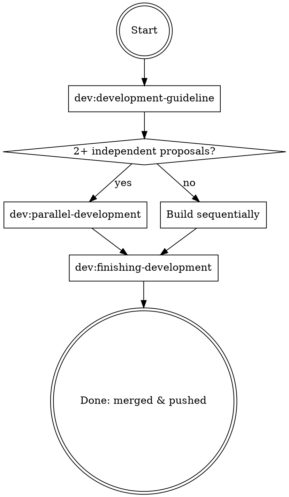

# Full Development Cycle

## Overview

The end-to-end orchestrator for a development session. It chains the three `dev:` skills into one disciplined flow: **plan & build → (parallelize if needed) → finish**. It introduces no new mechanics — each linked skill remains the source of truth for its phase.

## When to Use

- You want to take work from idea to merged-and-pushed in one coherent flow.
- A session will run proposal → implementation → landing the branch.

## The Cycle

| Stage | Skill | Purpose |
|---|---|---|
| 1. Build | `dev:development-guideline` | propose → apply → archive, TDD, VDD, visual confirm |
| 2. Parallelize | `dev:parallel-development` | Only if 2+ independent proposals |
| 3. Finish | `dev:finishing-development` | Archive, commit & push, merge back |

## How to Run

1. **Invoke `dev:development-guideline`** and follow it — proposal-driven planning, TDD (backend), VDD (frontend), and the non-negotiable visual-confirmation mandate. Every change is proposed (`opsx:propose`), implemented (`opsx:apply`), and visually confirmed.
2. **If more than one independent proposal exists, invoke `dev:parallel-development`** — author all proposals in the main session, fan out one worktree + sub-agent per proposal, then integrate. Otherwise build sequentially under the guideline.
3. **Invoke `dev:finishing-development <target branch>`** — archives active OpenSpec changes, commits and pushes the current branch, and merges back into the target (defaults to the session branch, then `dev`, then `master`/`main`).

Do **not** skip the visual-confirmation mandate from step 1 before finishing in step 3.

## Cross-References

- Methodology → `dev:development-guideline`
- Parallel execution → `dev:parallel-development`
- Landing the work → `dev:finishing-development`
