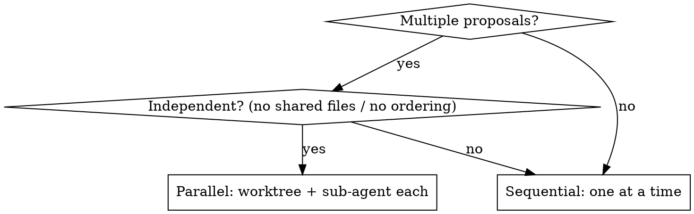

# Parallel Development

## Overview

When a session involves more than one proposal, the main session keeps the context and orchestrates; the work fans out into one git worktree + one sub-agent per proposal, then folds back in.

**Core principle:** the main session authors and integrates; sub-agents implement in isolation. Sub-agents commit, never merge. Only the main session merges and cleans up.

## When to Use

- Two or more proposals/changes will be created in one session
- Several independent changes could be implemented concurrently

**When NOT to use (go sequential):**

- Changes touch the same files or depend on each other's output
- Only one proposal exists
- Work cannot be cleanly isolated

## Parallelizable? Decide first

## Workflow

### Phase 1 — Author ALL proposals in the main session

The main session holds the conversation context, so it creates every proposal and its complete artifacts (proposal, design, specs, tasks) itself — do NOT delegate proposal authoring to sub-agents. Use `opsx:propose` per change.

### Phase 2 — One worktree per proposal

**REQUIRED SUB-SKILL:** Use superpowers:using-git-worktrees.

Create one worktree per proposal under `./.worktree/<change-id>` (or `./.claude/.worktree/<change-id>`), each on its own branch off the current working branch.

### Phase 3 — One sub-agent per worktree (parallel)

**REQUIRED SUB-SKILL:** Use superpowers:dispatching-parallel-agents.

Dispatch one sub-agent per worktree, in a single message so they run concurrently. Each sub-agent:

- Uses the SAME model and SAME effort level as the main session (inherit — do not downgrade).
- Works only inside its assigned worktree.
- Implements its proposal following `dev:development-guideline` (backend TDD, frontend VDD, visual confirmation).
- Commits all its changes on its worktree branch.
- Does NOT merge and does NOT touch other worktrees.

### Phase 4 — Main session integrates and cleans up

After all sub-agents report done, the main session:

1. Merges each worktree branch back into the current working branch.
2. Resolves any conflicts (the main session has the full context).
3. Archives each merged change with `opsx:archive` (or `openspec-archive-change`), one at a time.
4. Removes each worktree and its branch after a successful merge (`git worktree remove`).

Sub-agents NEVER merge and NEVER archive — archiving touches the shared spec baseline, so doing it in parallel worktrees would conflict. Merge, archive, and cleanup all happen in the main session, sequentially, only after the merge succeeds.

## Quick Reference

| Step | Owner | Action |
|---|---|---|
| Author proposals | Main | Create all artifacts |
| Create worktrees | Main | One per proposal |
| Implement | Sub-agents | Parallel, in worktree |
| Commit | Sub-agents | On worktree branch |
| Merge | Main | Into working branch |
| Archive | Main | `opsx:archive` each change |
| Cleanup | Main | Remove worktrees |

## Cross-References

- Methodology each sub-agent follows → `dev:development-guideline`
- Worktree mechanics → superpowers:using-git-worktrees
- Parallel dispatch → superpowers:dispatching-parallel-agents
- Proposals → `opsx:propose`; implementing tasks → `opsx:apply`; archiving → `opsx:archive`
