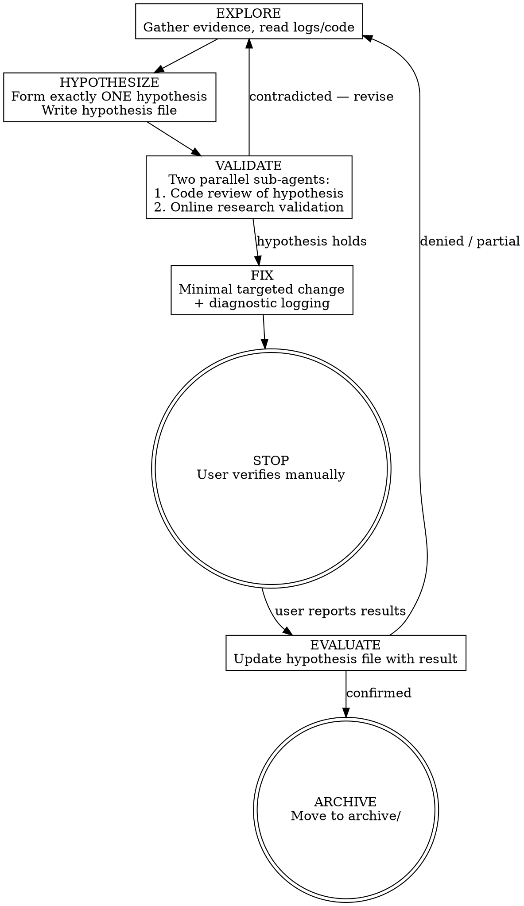

# HFV Full Cycle — Hypothesis-Fix-Verify

Systematic debugging workflow: one hypothesis, one fix, one verification — then stop.

## When to Use

- Debugging failures that can't be reproduced locally
- Issues where the fix must be verified manually in a real environment (staging, production, remote infra)
- Multi-layered problems where several independent causes may each need separate fixes
- Any bug where trial-and-error would waste deploy cycles without structure

## When NOT to Use

- Bugs reproducible locally with automated tests
- Simple code errors with obvious fixes
- Issues where you can run the verification yourself

<HOOK-SAFETY>
A pre-tool-use security hook scans ALL file-write content for security-sensitive substrings
related to: Python binary serialization, dynamic code evaluation, child process spawning,
OS command injection, and unsafe DOM manipulation.

When writing hypothesis markdown files, **do not include literal function names, module names,
or API calls** that relate to these security patterns. Instead:
- Use descriptive references: "Python's binary serialization module", "JavaScript's dynamic
  code evaluation function", "Node's child process spawning API", etc.
- Reference code by file path and line number rather than inlining:
  `See server.py:42 — uses unsafe deserialization`
- For evidence sections, describe WHAT the code does rather than quoting the literal tokens.

This avoids false-positive blocks from the security-guidance plugin without weakening the
actual security checks on real code files.
</HOOK-SAFETY>

## Core Principle

**Never stack hypotheses.** One hypothesis leads to one fix. The fix is verified before moving on. Unverified fixes create confusion about what actually worked.

## Artifact Structure

All HFV artifacts live in the project directory under `hfv/`:

```
hfv/
  <issue-name>/                          # Active investigation
    hypothesis-<desc>.md                 # Each hypothesis attempt
  archive/                               # Verified fixes
    <issue-name>/
      hypothesis-<desc>.md               # Archived with result
```

**Naming conventions:**
- `<issue-name>`: kebab-case description of the issue (e.g., `jdk21-tls-handshake-failure`)
- `<desc>`: kebab-case description of the specific hypothesis (e.g., `sha1-handshake-signature-blocked`)

## Hypothesis File Template

Each hypothesis file captures the full cycle for one attempt:

```markdown
---
status: pending | tested | confirmed | denied
created: YYYY-MM-DD
tested: YYYY-MM-DD (when user verified)
---

# Hypothesis: <one-sentence statement>

## Evidence

### Supporting
- <what supports this hypothesis>

### Contradicting
- <what contradicts it — be honest>

### Confidence: Low | Medium | High

## Fix

**File:** `<path>:<lines changed>`
**Change:** <what was changed and why>

## Verification Guide

**How to verify:**
1. <specific steps>
2. <what to look for>

**If correct:**
- <expected observable outcome>

**If wrong:**
- <what user will see instead>
- <what new information this gives us>

## Result

_Filled after user verification_

**Outcome:** CONFIRMED | DENIED | PARTIAL
**Observed:** <what actually happened>
**New evidence:** <what we learned>
```

## Workflow



## Phase Details

### EXPLORE

Gather all available evidence before forming a hypothesis:
- Read error logs, stack traces, debug output
- Read relevant source code and configuration
- Check documentation for the technology involved
- Review environment differences (JDK versions, OS, etc.)

**Output:** Summary of evidence collected, organized by relevance.

### HYPOTHESIZE

Form exactly ONE hypothesis. Write it to `hfv/<issue>/hypothesis-<desc>.md`.

**Priority order when multiple hypotheses exist:**
1. Highest confidence first
2. Among equal confidence, easiest to verify first
3. Among equal ease, smallest blast radius first

### VALIDATE

Before proceeding to fix, run a quick pre-filter using two parallel sub-agents to catch obviously wrong hypotheses early.

Dispatch both agents simultaneously using the Agent tool:

**Agent 1 — Code Review:**
> Re-read the hypothesis I just formed: [hypothesis summary]. Trace the relevant code paths
> in [files] and look for: (1) evidence that contradicts this hypothesis, (2) assumptions
> that don't hold in the actual code, (3) a simpler explanation I may have missed. Report
> what you find in under 200 words.

**Agent 2 — Online Research:**
> Search online for: [error/symptom] caused by [hypothesized cause]. Check known issues,
> official docs, changelogs, and community discussions. Does external evidence support or
> contradict this hypothesis? Report in under 200 words.

**After both return:**
- Either raises a concrete contradiction → incorporate into the hypothesis's "Contradicting"
  evidence, reconsider confidence level, and revise if warranted. If contradicted, return to EXPLORE.
- Both support → proceed to FIX with increased confidence
- Inconclusive → note that and proceed to FIX as-is

### FIX

Implement the minimal change that tests this hypothesis:
- Change as little as possible — isolate the variable
- Add diagnostic logging if the fix alone won't produce clear verification signal
- Explain every line changed and why
- Update the hypothesis file's Fix section

### STOP

Do NOT proceed to another hypothesis. Wait for user verification results.

**Red flags that you're about to violate this:**
- "While we wait, let me also fix..."
- "Another thing that could help..."
- "Let me also add..."
- "Just in case, I'll also..."

### EVALUATE

When the user reports results, update the hypothesis file:
- **CONFIRMED** -> proceed to archive
- **DENIED** -> update Result section, back to EXPLORE with new evidence
- **PARTIAL** -> update Result section, back to EXPLORE noting what improved

### ARCHIVE

Move the issue directory to `hfv/archive/<issue-name>/`.

## Hypothesis Tracking

When multiple hypotheses have been tried for an issue, the directory accumulates them:

```
hfv/jdk21-tls-handshake/
  hypothesis-tls-rsa-cipher-disabled.md      # status: confirmed
  hypothesis-sha1-handshake-blocked.md       # status: pending
```

This provides a clear audit trail of what was tried, what worked, and what didn't.
