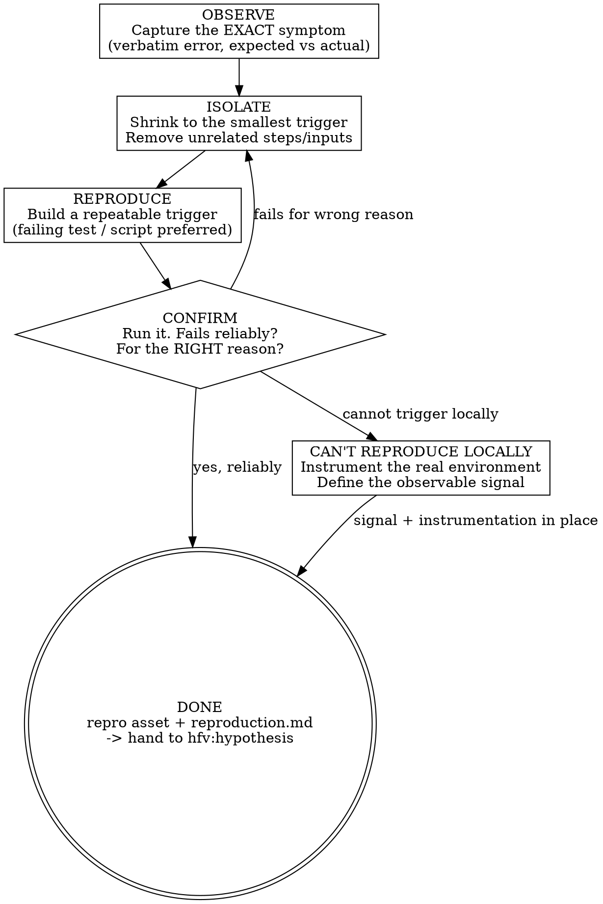

# HFV Reproduce — Trigger the Failure on Demand, First

Establish a **repeatable trigger** for the failure before anything else. A bug you cannot reproduce is a bug you cannot fix — only guess at.

<REAL-DATA-ONLY>
**The reproduction MUST run against the REAL system with REAL data. A mock, stub, fake, or simulated reproduction is NOT a reproduction — it is a restatement of your own assumptions, and it proves nothing.**

- Call the **real method / endpoint** the user named — with its real signature — not a wrapper, not a re-implementation.
- Hit the **real data source** (real DB, real API, real service, real environment) the bug occurs in. Reads against prod/dev data are the point; that is where the bug lives.
- Use the **real identifiers** from the report (the actual user, tenant, account, id), not invented placeholders.
- A mock can only return what you told it to return. If you mock the dependency and then "observe" the failure, you have observed your hypothesis, not the bug. That is the single most common way this phase is faked — do not do it.
- The ONLY time a test double is acceptable is to bypass an unrelated transport/auth layer that is not part of the failure (e.g. faking a session token), and even then every component on the failure's path stays real.

If you cannot reach the real system/data, you have NOT reproduced — say so, and use the `CAN'T REPRODUCE LOCALLY` path (instrument the real environment); do not substitute a mock and call it done.
</REAL-DATA-ONLY>

## When to Use

- The first phase of ANY debugging cycle, before `hfv:hypothesis`
- A bug/crash/500/wrong-output is reported and you don't yet have a button you can press to make it fail
- "Intermittent", "flaky", "only at peak", "happens sometimes" — determinism is unknown
- You have a hunch about the cause but no way to confirm the failure is even happening for the reason you think

## When NOT to Use

- You already have a reliably-failing test or command that triggers the exact symptom (go straight to `hfv:hypothesis`)
- The "bug" is a feature request or a known-by-design behavior

<HARD-GATE>
You may CREATE a failing test or a repro script (these are diagnostic assets, not fixes).
You may ADD logging/instrumentation to surface evidence.
You may NOT change product code to make the failure go away — that is `hfv:fix`, and it is premature until the failure is reproduced. Reproduce captures the bug; it does not repair it.
</HARD-GATE>

<HOOK-SAFETY>
A pre-tool-use security hook scans ALL file-write content for security-sensitive substrings
related to: Python binary serialization, dynamic code evaluation, child process spawning,
OS command injection, and unsafe DOM manipulation.

When writing the reproduction markdown file, **do not include literal function names, module
names, or API calls** that relate to these security patterns. Instead:
- Use descriptive references: "Python's binary serialization module", "Node's child process
  spawning API", etc.
- Reference code by file path and line number rather than inlining: `See server.py:42`.
- Describe WHAT the code does rather than quoting the literal tokens.
</HOOK-SAFETY>

## Core Principle

**Reading evidence is not reproducing.** Logs, stack traces, metrics, and code-reading tell you *what might be wrong* — they are inputs to a hypothesis. Reproduction is a separate, harder thing: a trigger you control that makes the failure happen **now, on demand, for the right reason**. Without it you have no oracle — no objective way to know, later, whether a fix worked or whether the problem simply went quiet on its own.

**A reproduction is the verification oracle the whole HFV cycle depends on.** Build it first.

## Artifact

Lives alongside the other HFV artifacts in the project's `hfv/` directory:

```
hfv/
  <issue-name>/
    reproduction.md      # produced by THIS phase
    repro_test.<ext>     # optional: the failing test / script (the repro asset)
    hypothesis-<desc>.md # produced later by hfv:hypothesis
```

### reproduction.md template

```markdown
---
status: reproduced | partial | not-reproduced
created: YYYY-MM-DD
determinism: always | N-of-M | conditional
---

# Reproduction: <one-line symptom>

## Symptom (observed, verbatim)
<the EXACT failure — error message, status code, wrong value. Not a paraphrase.>

## Trigger
**How to make it fail:** <exact, copy-pasteable command / steps / input>
**Frequency:** every run | <N> of <M> runs | only when <condition>

## Minimal case
<the smallest input/setup that still fails, and what you stripped away to get there>

## Expected vs Actual
- **Expected:** <what should happen>
- **Actual:** <what happens instead — tie back to the verbatim symptom>

## Repro asset
**File:** `<path to failing test / script>`  (omit if reproduced manually only)
**Runs green after fix?** <this asset is what FIX will be verified against>

## Determinism notes
<what the failure depends on: load, ordering, timing, specific data, version, env.
If it could NOT be made deterministic, say exactly what was tried.>
```

## Workflow



## Phase Details

### OBSERVE
Pin down the failure precisely before chasing causes.
- Capture the symptom **verbatim** — the actual error text, status code, or wrong value. A paraphrase ("it crashes") hides the information that identifies the real failure.
- State **expected vs actual** explicitly. If you can't say what "correct" looks like, you can't recognize a reproduction or a fix.

### ISOLATE
Shrink the failure to its smallest reliable trigger.
- Remove steps, inputs, data, and config that aren't required to make it fail.
- The narrower the trigger, the faster every later phase runs and the clearer the eventual root cause.
- What survives the shrinking IS the bug's dependency surface — note it.

### REPRODUCE
Turn the trigger into something you can run on demand.
- **Prefer an automated failing test or a one-shot script** over manual steps — it is rerunnable, shareable, and becomes the fix's pass/fail oracle.
- Run it and watch it fail. A test that doesn't fail yet proves nothing.

### CONFIRM (the gate)
Do not leave this phase until ONE of these is true:
- The repro **fails reliably** (or you've recorded its exact frequency, e.g. "3 of 10 runs"), **and** it fails for the symptom you set out to reproduce — not a different error.
- You've genuinely established it **cannot be triggered locally** and moved to the can't-reproduce path below.

**Fails for the wrong reason?** (typo, missing fixture, unrelated error) — that's not a reproduction. Return to ISOLATE.

### CAN'T REPRODUCE LOCALLY
Some failures are environment-bound (real load, prod data, specific infra). When you've honestly exhausted local triggering:
- Add **instrumentation/logging** at the suspected boundaries so the real environment yields evidence on the next occurrence.
- Define the **observable signal** that counts as "reproduced" (e.g. "this log line with count > pool max").
- Record `status: not-reproduced` with what was tried, and hand off to `hfv:full`, whose manual-verification loop is built for exactly this case.

This is a real outcome — not a failure of the phase. Honest "not-reproduced + instrumentation" beats a fake green.

## Done = hand-off

When reproduced, you hold two things the rest of the cycle needs:
1. `reproduction.md` — the symptom, trigger, and determinism
2. (ideally) a **failing repro asset** — the oracle `hfv:fix` will be verified against

Then proceed to `hfv:hypothesis`.

## Rationalization Table

Captured from watching agents debug under pressure — every one of these skips reproduction:

| Excuse | Reality |
|--------|---------|
| "I'll mock the dependency to reproduce it" | A mock returns only what you told it to. You'd be confirming your assumption, not the bug. Hit the REAL system + REAL data. |
| "A unit test with the failure asserted reproduces it" | Asserting `== []` against a stub proves the stub, not the system. Reproduction = the real call produces the failure on its own. |
| "I read the logs/metrics, I know the cause" | Reading evidence ≠ reproducing. Evidence feeds a hypothesis; it isn't a trigger you control. |
| "It's obviously the connection pool / null / race" | Obvious causes are wrong often enough that an unverified one wastes a deploy cycle. Reproduce, then confirm. |
| "It's intermittent, can't be reproduced" | "Intermittent" means determinism is unknown, not zero. Measure the rate (N of M), or instrument. Don't skip. |
| "Let me just ship the fix and watch prod" | With no repro you can't tell a fix from luck. Prod going quiet is not proof. |
| "Writing a repro test is slower than fixing it" | A guessed fix with no oracle is the slow path — it reopens. The repro IS the fast path. |
| "Manual verification confirmed it once" | Once ≠ on-demand. Capture the steps so it's repeatable by anyone, including future-you. |
| "Confirming the diagnosis is the same as reproducing" | Confirming *why* is hypothesis work. Reproducing is making it *fail again* on command. Different jobs. |

## Red Flags — STOP, you're skipping reproduction

- Reaching for a mock/stub/fake instead of the real method + real data — STOP, that reproduces nothing
- Re-implementing the dependency's logic in the test instead of calling the real one
- Calling a wrapper/public method when the user named a specific method — call the one they named
- Proposing a fix, config change, or "mitigation" before the failure fails on demand
- Describing the cause ("it's X") instead of the trigger ("run Y → see Z")
- "Let me also fix..." / "while I'm in here..." before CONFIRM passes
- Treating a log line or metric reading as the reproduction
- Calling it reproduced when the test fails for a *different* error than the reported symptom

**All of these mean: stop. Return to OBSERVE/ISOLATE and produce a trigger you control.**

## Common Mistakes

- **Paraphrasing the symptom.** "It errors out" loses the exact message that names the bug. Quote it.
- **Reproducing a neighbor, not the bug.** A red test is only a repro if it's red for the *reported* reason.
- **Stopping at "works on my machine, fails sometimes."** Pin the frequency or the condition; an unmeasured "sometimes" can't validate a fix.
- **Substituting a mock for the real system.** The cardinal sin (see REAL-DATA-ONLY). A reproduction built on test doubles proves your assumptions, not the bug. Call the real method against the real data source with the real identifiers. Doubles are allowed ONLY for an unrelated transport/auth shim, never for any component on the failure's path.
- **Calling the wrong entry point.** When the report names a specific method, reproduce by calling THAT method with its real signature — not a higher-level wrapper that may mask or reshape the failure.
