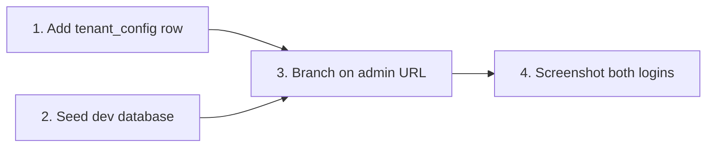

# Show Plan

## Overview

Displays the plan that is already in play. It does not invent one, does not refine one, and does not start executing one.

The output is always the same four blocks, in this order:

1. **Goal** — one sentence.
2. **Graph** — how the steps depend on each other.
3. **Matrix** — every step as a row.
4. **Detail** — one worked example per row.

## HARD GATE — read only

| Allowed | Forbidden |
|---|---|
| Read, Grep, Glob | Edit, Write, NotebookEdit |
| `git log/status/diff` | Any `git` command that writes |
| `ls`, `cat` | Running builds, tests, servers |
| Reading plan files | Starting any step of the plan |

You write no file — not even the plan itself — unless the user asks for one. Present in chat.

## Step 1 — find the plan

Look in this order and stop at the first hit:

1. The active plan or todo list in this session.
2. `openspec/changes/*/` — read `proposal.md`, `design.md`, and `tasks.md`.
3. A proposal or plan file named in the conversation.
4. The plan agreed in this conversation but never written down.

Say which source you used, in one line, before the Goal block.

If there is no plan anywhere, say exactly that and stop. Do not draft one.

## Step 2 — FULL means full

Show every step. No "…and 4 more", no "the rest follow the same pattern", no collapsing similar steps into one row.

If the plan has 23 steps, the matrix has 23 rows. A long plan is the reason the user asked.

## Step 3 — Goal

One sentence, plain English, no jargon. What is true when the whole plan is done.

Then one line: what is done already, what is left. Real numbers — "4 of 11 steps done".

## Step 4 — Graph

A mermaid `flowchart LR` (or `TD` when the plan is deep rather than wide) showing dependency, not chronology.

Rules:

- Node label = step number + short name. Nothing longer than ~30 characters.
- Draw an arrow ONLY where step B genuinely cannot start until step A lands. Steps with no arrow between them run in parallel — that is the whole value of the graph.
- Mark anything already finished: `S1[1. Add row]:::done` plus `classDef done fill:#d4edda,stroke:#28a745`.
- Mark blocked steps: `classDef blocked fill:#f8d7da,stroke:#dc3545`.
- Below the graph, one line naming the critical path: `Critical path: 1 → 3 → 4 → 7`.

If the plan is a straight line with no parallelism, say so in one line and still draw it — the user asked for the graph.

## Step 5 — Matrix table

One row per step. Every cell ≤ 30 characters. No semicolon lists inside a cell — if three facets matter, add three columns.

| # | Step | Touches | Depends on | Effort | Status |
|---|---|---|---|---|---|
| 1 | Add tenant_config row | `tenant_config` | — | 5 min | done |
| 2 | Seed dev database | `seed.sql` | — | 10 min | done |
| 3 | Branch on admin URL | `auth/login.py` | 1, 2 | 30 min | now |
| 4 | Screenshot both logins | — | 3 | 10 min | blocked |

Column rules:

- **Touches** — one real file, table, or endpoint. Not a description.
- **Depends on** — step numbers only, or `—`.
- **Effort** — concrete units: `5 min`, `2 h`, `half a day`. Never "some work".
- **Status** — one of `done`, `now`, `next`, `blocked`.

Add columns when the plan needs them (`Owner`, `Risk`, `Verify`). Never widen a cell to fit more.

## Step 6 — Detail, one per row

The matrix is an index. On its own it is unreadable — the 30-character cells cannot carry the meaning. So under it, give every row a short paragraph in plain English with:

1. The real file and line, or the real table and column.
2. A real value from the actual code or database.
3. What goes wrong, or what stays broken, if this step is skipped.

Example of the shape:

> **3. Branch on admin URL** — `auth/login.py:88` currently reads `tenant_config.login_mode` and always gets `"standard"`. The step adds the `is_admin_login` check so a request to `admin.example.com` takes the SSO branch instead. Skip it and admins keep landing on the password form they cannot use.

A reader who has never seen this codebase must follow it without asking. If you cannot write that paragraph for a row, you do not understand the row — go read the code, or drop the row and say why.

## Step 7 — Close

One line: the single next action, small enough to start now.

`Next: open auth/login.py:88.`

## Never

- Never change a file, run a build, or start a step. This command shows; it does not do.
- Never re-open a decision the user already made. If a step says "add a row to `tenant_config`", that is the design — show it, do not counter-propose.
- Never pad the matrix with rows that are not real work.
- Never replace the graph or the matrix with a bullet list.
