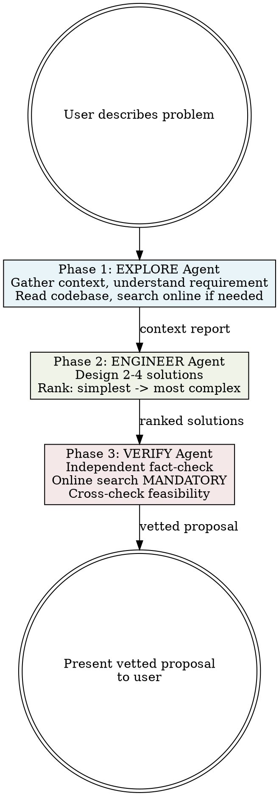

# Propose

## Overview

Sequential three-agent pipeline that explores a problem, engineers ranked solutions, and independently verifies feasibility through online research. Presents vetted proposals to the user.

**Core principle:** Trust but verify. Each agent builds on the previous, but the final agent independently fact-checks everything.

**This skill is read-only. No code changes. No file edits. Present findings only.**

## When to Use

- User wants to understand options before committing to a change
- Problem needs exploration before engineering a solution
- User needs confidence that a proposed approach actually works
- User says "propose", "what are my options", "how should we approach this"

**When NOT to use:**
- User already knows what they want and said to implement it
- Simple, well-understood change with an obvious path
- Pure code review -> use `review` skill
- Pure exploration without solutions -> use `no-code-change` skill

## Workflow



**IMPORTANT:** Each phase is a separate Agent tool call. Wait for each agent to complete before launching the next. Do NOT combine phases or run them in parallel.

---

### Phase 1: EXPLORE Agent

**Purpose:** Gather all context needed to understand the problem.

Dispatch as an Agent (subagent_type: `Explore`) with:
- The user's original request
- Instructions to explore broadly

**Agent instructions:**
- Understand the user's requirement — restate it in your own words
- Read relevant codebase files: source, config, dependencies, tests
- Identify existing patterns, conventions, and constraints
- Search online (WebSearch) if the problem involves external libraries, APIs, or unfamiliar patterns
- Note what limits the solution space: coupling, tech debt, API contracts, backwards compatibility

**Required output format:**
```
## Explore Report

### Requirement
[What the user wants, restated]

### Codebase Context
[Relevant files, patterns, dependencies, conventions found]
[Include file:line references]

### External Context
[Online findings — docs, known patterns, version constraints]
[Include links where applicable]

### Constraints
[What limits the solution space — coupling, contracts, compatibility]
```

---

### Phase 2: ENGINEER Agent

**Purpose:** Design solutions ranked from simplest to most complex.

Dispatch as an Agent with:
- The full Explore Report from Phase 1
- The user's original request

**Agent instructions:**
- Design 2-4 solution approaches based on the explore report
- Rank strictly from simplest to most complex:
  1. **Minimal** — config change, flag flip, one-line fix, existing utility
  2. **Moderate** — targeted code changes, new function/method, small refactor
  3. **Significant** — new module, interface changes, multi-file coordination
  4. **Complex** — architecture change, full revamp (only if genuinely warranted)
- Skip complexity levels that don't apply — don't force solutions
- For each: describe approach, list files affected, estimate scope, note trade-offs
- State your recommendation and why

**Required output format:**
```
## Engineering Report

### Solution 1: [Name] — Minimal
- **Approach:** [What to do]
- **Files affected:** [file:line references]
- **Scope:** [Estimated lines/files changed]
- **Trade-offs:** [Pros and cons]

### Solution 2: [Name] — Moderate
...

### Recommendation
[Which solution and why — consider effort vs. value, risk, maintainability]
```

---

### Phase 3: VERIFY Agent (Critical)

**Purpose:** Independent fact-checking and feasibility verification. This is the most important phase.

Dispatch as an Agent with:
- Both the Explore Report AND Engineering Report
- The user's original request
- Explicit instruction that online search is mandatory

**Agent instructions — be skeptical, assume previous agents could be wrong:**
- Re-read both reports with fresh eyes — look for gaps, assumptions, contradictions
- **Online verification is MANDATORY — you must perform these searches:**
  - Search for proposed APIs, functions, config options — do they actually exist in the current version?
  - Search open source repos (GitHub) for similar implementations — has anyone done this?
  - Search GitHub issues, Stack Overflow, community discussions — are there known problems with this approach?
  - Check official library/framework docs for version compatibility and deprecations
- Flag anything that looks hallucinated, outdated, or unverified
- Assess each proposed solution's feasibility independently
- Check if a simpler solution was missed entirely
- Verify that the stated constraints are real (not assumed)

**Required output format:**
```
## Verification Report

### Fact-Check Results
| Claim | Verified? | Evidence |
|-------|-----------|----------|
| [claim from engineering report] | YES/NO/PARTIAL | [source link or finding] |

### Feasibility Assessment
[For each solution: feasible / risky / infeasible, with reasoning]

### Online Evidence
[Links and references found — docs, issues, discussions, similar implementations]

### Missed Alternatives
[Simpler approaches the engineer didn't consider, if any]

### Final Recommendation
[Vetted recommendation with confidence: HIGH / MEDIUM / LOW]

### Warnings
[Anything the user should know — deprecations, known issues, edge cases, risks]
```

---

## Presenting Results

After all three phases complete, synthesize into a single proposal:

1. **One-line summary** of the recommended approach
2. **Ranked options table:**

| # | Solution | Complexity | Verified | Confidence |
|---|----------|------------|----------|------------|
| 1 | [name] | Minimal | [checkmark] verified | HIGH |
| 2 | [name] | Moderate | [warning] partially | MEDIUM |

3. **Key evidence** — most important findings from online verification, with links
4. **Warnings** — anything flagged by the verify agent
5. **Recommended next step** — which option to proceed with and why

**Do NOT make any code changes. Do NOT call Edit, Write, or NotebookEdit. Present the proposal and wait for the user to decide.**

## Red Flags — STOP

- About to edit or write a file -> STOP. This skill is read-only.
- Skipping Phase 3 verification ("the solutions look obvious") -> Phase 3 is mandatory.
- Not doing online searches in Phase 3 ("I'm confident") -> Online search is mandatory.
- Combining phases into one agent -> Each phase MUST be a separate agent.
- Running phases in parallel -> Phases are sequential. Each depends on the previous.
- Presenting unverified claims as verified -> Everything must have evidence.

## Common Mistakes

| Mistake | Fix |
|---------|-----|
| Skipping online search in Phase 3 | Online verification is MANDATORY — catches hallucinated APIs and impossible approaches |
| Engineer copies explore findings without adding value | Engineer must design NEW solutions, not summarize what exists |
| Verify agent rubber-stamps engineering report | Verify must be INDEPENDENT and SKEPTICAL — assume previous agents could be wrong |
| Too many solutions (5+) | Cap at 4, skip complexity levels that don't apply |
| All solutions at same complexity level | Force ranking minimal -> complex. There is almost always a simpler option |
| Making code changes | This skill is READ-ONLY. Present findings. Change nothing. |
| Running agents in parallel | Phases are SEQUENTIAL. Each builds on the previous output. |
