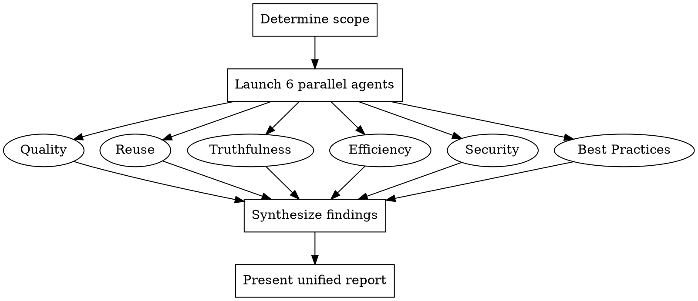

# Code Review

## Overview

Comprehensive code review using 6 parallel specialist sub-agents. Each agent independently analyzes the code from a different perspective, then findings are synthesized into a single prioritized report.

**Core principle:** Multiple focused lenses catch more than one generalist pass.

## Workflow



### Step 1: Determine Review Scope

Before launching agents, identify what to review:

1. Check `git diff` for uncommitted changes
2. Check `git diff --staged` for staged changes
3. If user specified files or a PR, use that scope
4. If no changes found, ask the user what to review

Collect: list of changed files, the diff content, and any relevant context (PR description, commit messages).

### Step 2: Launch 6 Parallel Sub-Agents

Launch ALL six agents simultaneously using the Agent tool. Each agent receives:
- The list of changed files
- The diff or file contents
- Its specific review focus area
- Instructions to return a structured report

**IMPORTANT:** All 6 Agent() calls MUST be in a single message to run in parallel.

Each agent must return findings in this format:
```
## [Agent Name] Review

### Critical (must fix)
- [file:line] Description of issue

### Important (should fix)
- [file:line] Description of issue

### Suggestions (nice to have)
- [file:line] Description of suggestion

### Positive
- What's done well
```

---

#### Agent 1: Code Quality

```
Focus: Readability, naming, structure, complexity, maintainability.

Analyze:
- Are variable/function/class names clear and descriptive?
- Is the code well-structured with appropriate separation of concerns?
- Is cyclomatic complexity reasonable? Are functions too long?
- Is there dead code, commented-out code, or unnecessary complexity?
- Are abstractions at the right level — not too clever, not too verbose?
- Is error handling clear and consistent?
- Is the control flow easy to follow?

Report issues with specific file:line references.
```

#### Agent 2: Code Reuse

```
Focus: DRY violations, missed abstractions, existing utilities ignored.

Analyze:
- Is there duplicated logic that should be extracted?
- Are there existing utilities/helpers in the codebase that could replace new code?
  (Search the codebase for similar patterns using Grep/Glob)
- Are there framework-provided features being reimplemented?
- Is there copy-pasted code from other files?
- Could shared types, constants, or configurations be reused?

Search the actual codebase for existing patterns before flagging.
Report issues with specific file:line references.
```

#### Agent 3: Code Truthfulness

```
Focus: Verify library usage, API calls, and code patterns against real documentation.

Analyze:
- Are library/framework APIs used correctly? (Check via WebSearch or context7 docs)
- Are function signatures, parameters, and return types correct per documentation?
- Are deprecated APIs being used when newer alternatives exist?
- Are configuration options valid and correctly spelled?
- Do code comments accurately describe what the code does?
- Are there common misconceptions about the libraries being used?

You MUST use WebSearch or context7 MCP to verify at least the key library usages.
Do not rely on training data alone — look up the actual current docs.
Report issues with specific file:line references and documentation links.
```

#### Agent 4: Code Efficiency

```
Focus: Performance, resource usage, algorithmic complexity.

Analyze:
- Are there O(n^2) or worse algorithms where O(n) or O(n log n) is possible?
- Are there unnecessary allocations, copies, or iterations?
- Are database queries efficient? N+1 query problems?
- Are there memory leaks (unclosed resources, unbounded caches)?
- Is there unnecessary synchronous blocking?
- Are expensive operations repeated when results could be cached?
- Are there rendering performance issues (unnecessary re-renders, missing memoization)?

Report issues with specific file:line references and estimated impact.
```

#### Agent 5: Code Security

```
Focus: Vulnerabilities, injection risks, data exposure, OWASP top 10.

Analyze:
- SQL injection, command injection, XSS, CSRF risks?
- Are user inputs validated and sanitized at system boundaries?
- Are secrets, tokens, or credentials hardcoded or logged?
- Are authentication/authorization checks in place?
- Are there path traversal or file inclusion vulnerabilities?
- Is sensitive data properly encrypted in transit and at rest?
- Are dependencies up to date with no known CVEs?
- Are error messages leaking internal details?

Report issues with specific file:line references and severity assessment.
```

#### Agent 6: Code Best Practices

```
Focus: Language idioms, framework conventions, project standards.

Analyze:
- Does the code follow the language's idiomatic patterns?
- Does it follow the project's established conventions? (Check CLAUDE.md, linter config, existing code)
- Are tests included for new functionality? Are they meaningful?
- Is the code properly typed (if applicable)?
- Are edge cases handled?
- Does the code follow SOLID principles where appropriate?
- Are commits atomic and well-structured?

Read the project's CLAUDE.md and linter/formatter configs to understand project conventions.
Report issues with specific file:line references.
```

### Step 3: Synthesize Findings

After ALL agents return, synthesize their reports:

1. **Deduplicate** — Multiple agents may flag the same issue from different angles. Merge these into a single finding, noting which perspectives identified it (consensus findings are higher confidence).

2. **Prioritize** — Rank by severity:
   - **Critical**: Security vulnerabilities, data loss risks, correctness bugs — must fix
   - **Important**: Performance issues, maintainability concerns, missing tests — should fix
   - **Suggestions**: Style improvements, minor optimizations — nice to have

3. **Note consensus** — When 2+ agents flag the same area, mark it as high-confidence. When only one agent flags something, note it but with lower confidence.

### Step 4: Present Unified Report

Present the synthesized report in this format:

```markdown
# Code Review Summary

**Scope:** [files reviewed]
**Agents:** Quality, Reuse, Truthfulness, Efficiency, Security, Best Practices

## Critical Issues (X found)
- **[SEVERITY]** [file:line] Issue description
  _Flagged by: Agent1, Agent2_ | _Confidence: high/medium_

## Important Issues (X found)
- **[SEVERITY]** [file:line] Issue description
  _Flagged by: Agent1_ | _Confidence: medium_

## Suggestions (X found)
- [file:line] Suggestion
  _Flagged by: Agent1_

## Strengths
- What the code does well (from Positive sections)

## Verdict
[One-line summary: "Ready to ship", "Fix critical issues first", "Needs significant rework", etc.]
```

**Show everything. Do NOT auto-fix.** Present the report and wait for the user to decide what to act on.

## Common Mistakes

| Mistake | Fix |
|---------|-----|
| Launching agents sequentially | All 6 MUST be in a single message for parallel execution |
| Auto-fixing issues found | Present report only — user decides what to fix |
| Skipping web search in truthfulness agent | Truthfulness agent MUST verify against real docs |
| Reporting raw agent outputs separately | Always synthesize into a single unified report |
| No file:line references | Every finding must reference specific code locations |
